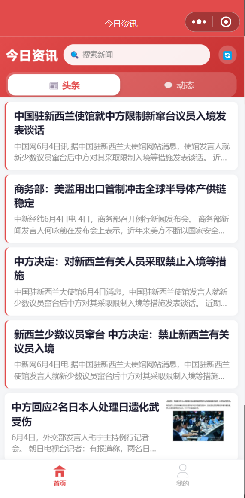
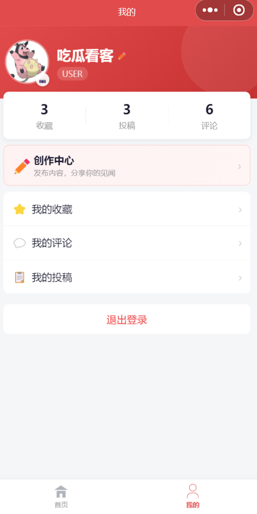
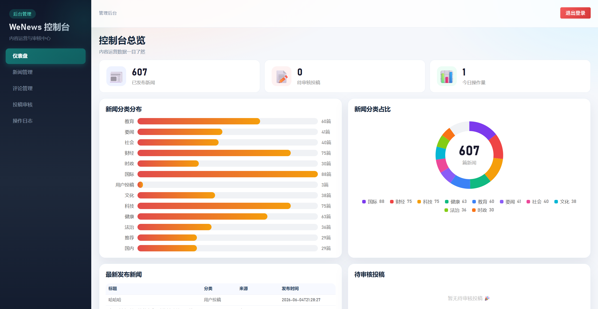

# WeNews - 移动新闻资讯平台

一个全栈移动新闻平台，涵盖**新闻聚合采集 → 后台内容管理 → 微信小程序消费 → 用户互动闭环**的完整链路。

## 项目架构

```
┌──────────────────────────────────────────────────────┐
│                    微信小程序 (C端)                      │
│  首页/动态 │ 新闻详情 │ 搜索高亮 │ 评论/点赞/收藏/分享      │
│  我的页面 │ 创作投稿 │ 图片上传 │ 登录注册                 │
└──────────────────────┬───────────────────────────────┘
                       │ HTTP API (JWT)
┌──────────────────────▼───────────────────────────────┐
│              Spring Boot 3 后端服务                     │
│  RESTful API │ MyBatis-Plus │ Spring Security + JWT   │
│  聚合数据接入 │ RSS 解析    │ Jsoup HTML 清洗             │
│  图片上传/存储 │ 操作日志   │ Redis Token 缓存            │
└──────────┬────────────────────────────┬──────────────┘
           │                            │
┌──────────▼──────────┐    ┌────────────▼──────────────┐
│   MySQL 数据库        │    │     Redis 缓存              │
│   news / user        │    │     token / session        │
│   comment / favorite │    └───────────────────────────┘
│   post_submission    │
│   user_news_like     │
└─────────────────────┘

┌──────────────────────────────────────────────────────┐
│                  Admin Web (管理端)                     │
│  仪表盘 │ 新闻管理 │ 评论管理 │ 投稿审核 │ 操作日志         │
│  Vue3 + Vite + Element Plus                           │
└──────────────────────────────────────────────────────┘
```

## 页面展示
### 小程序端


### 网页端


## 技术栈

| 层 | 技术 |
|------|------|
| **后端** | Spring Boot 3 / MyBatis-Plus / Spring Security / JWT / Jsoup |
| **管理后台** | Vue3 / Vite / Element Plus / Pinia / Axios / ECharts |
| **小程序** | 原生微信小程序 (WXML / WXSS / JS) |
| **数据库** | MySQL 8.0 / Redis 7 |
| **外部 API** | [聚合数据新闻头条 API](https://www.juhe.cn/docs/api/id/235) |
| **构建工具** | Maven / npm |

## 功能清单

### 微信小程序 (C端用户)

| 模块 | 功能 |
|------|------|
| **首页** | 头条频道 / 动态频道（各占一半 pill 切换）、骨架屏加载、无限滚动 |
| **新闻详情** | 封面大图、段落排版、图片预览、原文链接 |
| **搜索** | 标题搜索、关键词红色高亮 |
| **评论** | 发表评论、回复评论（@父评论者）、评论定位闪烁动画 |
| **点赞** | 点赞/取消（持久化到后端）、点赞数实时更新 |
| **收藏** | 收藏/取消、收藏列表带封面图 |
| **分享** | `onShareAppMessage` + `onShareTimeline` |
| **登录** | 微信一键登录 / JWT Token 认证 |
| **创作中心** | 投稿（标题+正文+图片/视频上传）、编辑投稿 |
| **我的** | 头像/昵称、我的收藏、我的评论、我的投稿（编辑/删除） |

### Admin Web (管理端)

| 模块 | 功能 |
|------|------|
| **仪表盘** | 统计卡片 + SVG 环形分类图 + 最新新闻 + 待审核列表 |
| **新闻管理** | CRUD + 聚合数据一键同步 + 封面图上传预览 |
| **投稿审核** | 预览（含图片）、通过/驳回、批量审核、删除 |
| **评论管理** | 全量评论列表、按类型筛选、删除 |
| **操作日志** | 后台操作记录查看 |

### 后端

| 模块 | 功能 |
|------|------|
| **新闻同步** | 聚合数据 API（50次/天，5频道轮询）+ RSS 备用源 |
| **图片处理** | 外部图片自动下载本地、防盗链处理 |
| **权限控制** | RBAC (ADMIN/EDITOR/USER)、接口级 @PreAuthorize |
| **安全性** | JWT + Refresh Token、密码 BCrypt 加密、上传目录隔离 |

## 快速开始

### 环境要求

- JDK 17+
- MySQL 8.0
- Redis 7
- Node.js 18+
- Maven 3.8+
- 微信开发者工具

### 1. 数据库

```sql
-- 创建数据库
CREATE DATABASE wenews DEFAULT CHARSET utf8mb4;

-- 导入表结构
mysql -u root -p wenews < backend/src/main/resources/db/schema.sql

-- 创建点赞表
CREATE TABLE IF NOT EXISTS user_news_like (
  id BIGINT AUTO_INCREMENT PRIMARY KEY,
  user_id BIGINT NOT NULL,
  news_id BIGINT NOT NULL,
  created_at DATETIME DEFAULT CURRENT_TIMESTAMP,
  UNIQUE KEY uk_user_news (user_id, news_id),
  INDEX idx_news_id (news_id)
) ENGINE=InnoDB DEFAULT CHARSET=utf8mb4;

ALTER TABLE news ADD COLUMN like_count BIGINT DEFAULT 0;
```

### 2. 配置

编辑 `backend/src/main/resources/application.yml`：

```yaml
spring:
  datasource:
    url: jdbc:mysql://127.0.0.1:3306/wenews?...
    username: root
    password: 你的密码
  data:
    redis:
      host: 127.0.0.1
      port: 6379

juhe:
  api:
    key: 你的聚合数据API_KEY   # 从 https://www.juhe.cn/docs/api/id/235 获取
```

### 3. 启动后端

```bash
cd backend
mvn spring-boot:run
# 默认端口 8080
# 首次启动自动创建 admin 账号: admin / Admin@123
# 自动从聚合数据同步新闻
```

### 4. 启动 Admin Web

```bash
cd admin-web
npm install
npm run dev
# 端口 5173，浏览器访问 http://127.0.0.1:5173
# 登录: admin / Admin@123
```

### 5. 启动小程序

1. 打开微信开发者工具
2. 导入项目 → 选择 `miniprogram/` 目录
3. AppID 使用测试号或你的 AppID
4. 详情 → 本地设置 → 勾选「不校验合法域名」
5. 编译运行

## 项目结构

```
project/
├── backend/                         # Spring Boot 后端
│   └── src/main/java/com/course/newsplatform/
│       ├── client/                  # 外部 API 客户端 (JuheNewsClient)
│       ├── common/                  # 通用类 (ApiResponse, BizException)
│       ├── config/                  # 配置 (Security, CORS, DataInit, StaticResource)
│       ├── controller/              # 控制器
│       │   └── admin/               # 管理端控制器
│       ├── dto/                     # 数据传输对象
│       ├── entity/                  # 数据库实体
│       ├── enums/                   # 枚举
│       ├── mapper/                  # MyBatis-Plus Mapper
│       ├── security/                # JWT 过滤器、Token 提供器
│       └── service/                 # 业务逻辑
│           └── impl/                # 实现类
├── admin-web/                       # Vue3 管理后台
│   └── src/
│       ├── api/                     # API 封装 (modules.js, request.js)
│       ├── router/                  # 路由配置
│       ├── stores/                  # Pinia 状态 (auth.js)
│       ├── styles/                  # 全局样式 (theme.css)
│       └── views/                   # 页面组件
├── miniprogram/                     # 微信小程序
│   ├── pages/
│   │   ├── news/                    # 首页 + 新闻详情
│   │   ├── me/                      # 我的 + 收藏 + 评论 + 投稿
│   │   ├── submission/              # 创作中心
│   │   └── login/                   # 登录
│   ├── custom-tab-bar/              # 自定义底部导航
│   └── utils/                       # 工具函数 (request, config)
├── docs/                            # 文档 + SQL 脚本
└── uploads/                         # 上传文件目录 (gitignored)
```

## API 概览

| 路径 | 方法 | 说明 | 权限 |
|------|------|------|------|
| `/api/auth/wechat/login` | POST | 微信登录 | 公开 |
| `/api/auth/admin/login` | POST | 后台登录 | 公开 |
| `/api/news` | GET | 新闻列表（分页+搜索+分类） | 公开 |
| `/api/news/{id}` | GET | 新闻详情（含媒体列表） | 公开 |
| `/api/news/{id}/like` | POST | 点赞切换 | 登录 |
| `/api/comments` | GET/POST | 评论列表/发表 | 公开/登录 |
| `/api/submissions` | POST | 创建投稿 | 登录 |
| `/api/me/profile` | GET | 个人信息 | 登录 |
| `/api/me/favorites` | GET | 我的收藏 | 登录 |
| `/api/files/upload` | POST | 上传文件 | 登录 |
| `/api/admin/dashboard` | GET | 仪表盘数据 | ADMIN/EDITOR |
| `/api/admin/news/sync/juhe` | POST | 聚合同步 | ADMIN/EDITOR |
| `/api/submissions/admin` | GET | 投稿审核列表 | ADMIN/EDITOR |
| `/api/comments/admin/all` | GET | 全量评论 | ADMIN/EDITOR |

## 默认账号

| 角色 | 用户名 | 密码 |
|------|--------|------|
| 管理员 | admin | Admin@123 |

首次启动时 `DataInitializer` 自动创建。

## License

  SDU - 课程作业项目
